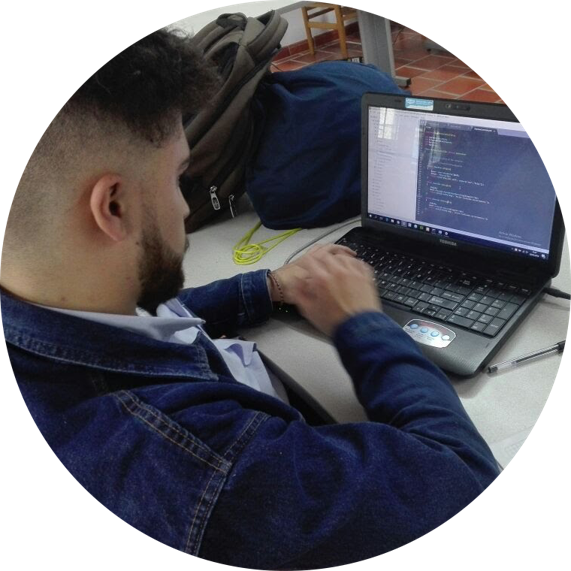
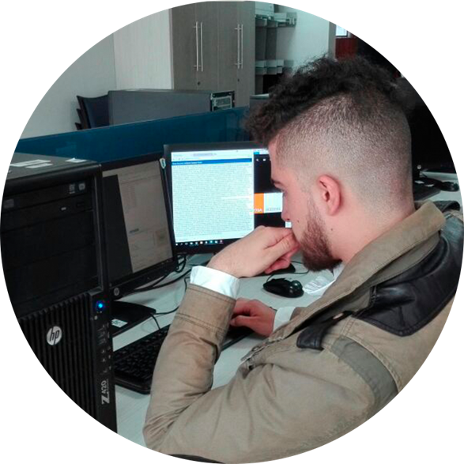
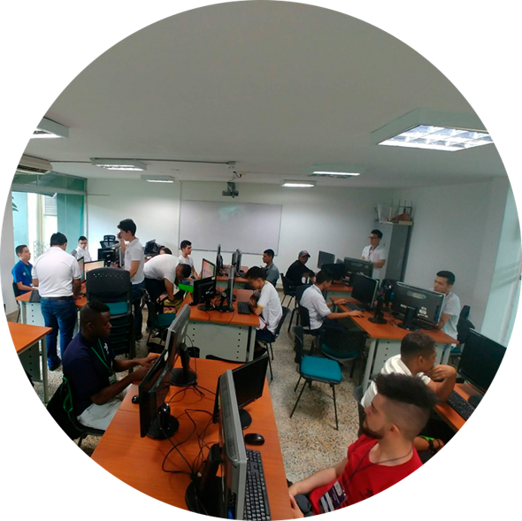
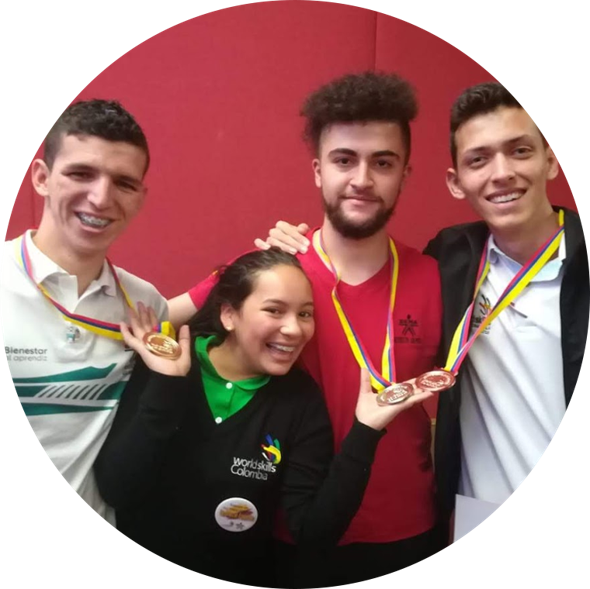
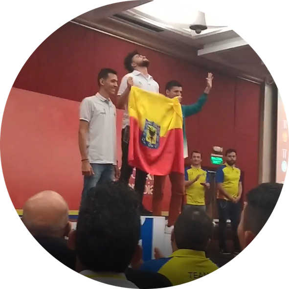

# WorldSkills
## ¿Qué es WorldSkills?
* Es un espacio para demostrar las habilidades de los aprendices a nivel nacional e internacional.
* Se busca conectar a los representantes con el sector productivo, y así aportar como país en la estructuración de nuevas habilidades internacionales.

```
    Es una estrategia que busca llevar la formación técnica del SENA a los máximos estándares internacionales.    
```

## 🧔 ¿Quien soy?

Soy Oscar Amado representante de Colombia en [Worldskills Kazán 2019](https://worldskills2019.com/en/) la competencia internacional más importante del mundo a nivel técnico y tecnológico con más de 1300 competidores de 63 paises en la habilidad [tecnologías web](https://worldskills.org/skills/id/127/). 

## Ciclo WorldSkills
* Competencias entre fichas o centro.
* Competencia entre centros de formación.
* Preselección regional (Bucaramanga / Colombia).
* Competencia regional.
* Preselección nacional.
* Competencia nacional.
* Repechaje nacional.
* Competencia internacional. (Kazán / Rusia).

## ✔ Resultados de mi ciclo
### 🥇 Competencias entre fichas o centro.
<div style="width: 200px">
    
</div>

Más de 20 competidores de diferentes trimestres y programas de formación de mi centro.

_“Primer puesto.”_

### 🥇 Competencia entre centros de formación.
<div style="width: 200px">
    
</div>

9 Los mejores competidores de cada centro de 5 centros deformación de Distrito capital.
* Centro de Electricidad, Electrónica y Telecomunicaciones
* Centro para la Industria de la Comunicación Gráfica
* Centro de Gestión de Mercados, Logística y TI
* Centro de Servicios Financieros
* Centro de Diseño y Metrología

_“Primer puesto.”_

### 🎫 Preselección regional (Bucaramanga / Colombia).
<div style="width: 200px">
    
</div>

22 competidores de diferentes regionales de Colombia.

_“Quinto lugar con pase a la competencia nacional.”_

### 🥈 Competencia nacional
<div style="width: 200px">
    
</div>

9 primeros puestos de la preselección nacional.

_“Medalla de plata.”_
```
Primer medalla de Distrito Capital en la habilidad diseño o tecnologías web.
Es algo historico quedaron 4 regionales que nunca habian estado en podio.

* 🥇 Guaviare
* 🥈 Distrito Capital
* 🥉 Quindio
* 🥉 Huila
* 🏅 Cundinamarca
```

### 🥇 Repechaje nacional
<div style="width: 200px">
    
</div>
4 competidores podio de la competencia nacional.
“Ganador del repechaje nacional”.

```
😄 Sueño, meta y objetivo cumplido. 
Desde este momento quedo como competidor internacional representado a Colombia en la habilidad tecnologías web.
```

## ✈ Entrenamientos y capacitaciones 

#INCOMING...

## License 🔥
Copyright © 2019-present [Oscar Amado](https://github.com/ofaaoficial) 🧔